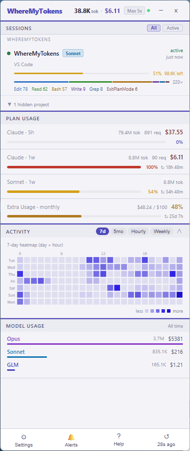
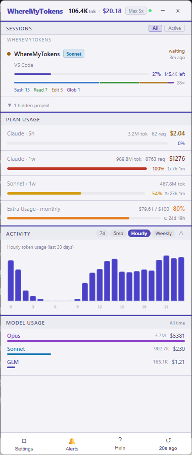

# WhereMyTokens

**Claude Code のトークン使用量をリアルタイムで監視する Windows システムトレイアプリ。**

タスクバーに常駐し、Claude Code の使用状況 — トークン数、コスト、セッション活動、レート制限 — を一目で確認できます。


[English](README.md) · [한국어](README.ko.md)

---

## 主な機能

- **リアルタイムセッション追跡** — 実行中の Claude Code セッション（ターミナル、VS Code、Cursor、Windsurf など）を検出し、リアルタイムの状態を表示：`active` / `waiting` / `idle` / `compacting`
- **レート制限バー** — Anthropic API から取得した 5 時間・週間使用量をプログレスバーとリセットカウンターで表示
- **Claude Code ブリッジ** — WhereMyTokens を Claude Code の `statusLine` プラグインとして登録し、API ポーリングなしでリアルタイムのレート制限データを受信
- **コンテキストウィンドウ警告** — セッションごとのインラインコンテキストバー；50% / 80% / 95%+ で色が変化
- **ツール使用バー** — セッションごとの比例色分けバー + 上位 3 ツール名（Bash、Edit、Read など）
- **アクティビティヒートマップ** — 7 日間ヒートマップ（曜日×時間）、5 ヶ月カレンダーグリッド（GitHub スタイル）、時間帯別分布、4 週間比較チャート
- **モデル別分析** — 全期間のモデルごとのトークン数・コスト合計
- **コスト表示** — USD または KRW、サブスクリプション換算価値
- **アラート** — 設定可能な使用量しきい値（50% / 80% / 90%）での Windows トースト通知
- **プロジェクト管理** — UI からプロジェクトを非表示にする、または追跡から完全に除外する
- **Extra Usage 予算** — 月間追加使用量カード（アカウントで有効な場合のみ表示）
- **常に最前面ウィジェット** — 他のウィンドウの上に固定表示；ヘッダーの `−` ボタンまたはトレイアイコンで最小化；グローバルホットキーで切り替え
- **トレイラベル** — タスクバーに使用量 %、トークン数、またはコストを直接表示

---

## スクリーンショット

<table align="center">
  <tr>
    <td align="center" width="340">
      <br/>
      <sub><b>セッション · プラン使用量 · 7日ヒートマップ</b></sub>
    </td>
    <td align="center" width="340">
      <br/>
      <sub><b>時間帯別トークン使用量（過去30日間）</b></sub>
    </td>
  </tr>
</table>

---

## Claude Code 連携（ブリッジ）

WhereMyTokens は公式の `statusLine` プラグインメカニズムを通じて、Claude Code からリアルタイムのレート制限データを受信できます — API ポーリング不要。

**仕組み：**
1. **Settings → Claude Code Integration → Setup** を実行
2. `~/.claude/settings.json` に WhereMyTokens を `statusLine` コマンドとして登録
3. Claude Code が実行されるたびに、セッションデータ（レート制限、コンテキスト %、モデル、コスト）を stdin 経由で送信
4. アプリが即座に更新 — ポーリングの遅延なし

ブリッジはコンテキストウィンドウ %、モデル、コストなどの補助データを提供します。レート制限のパーセンテージは常に Anthropic API を権威あるソースとして使用し、API が利用できない場合のみブリッジ値にフォールバックします。

---

## 動作要件

- Windows 10 / 11
- [Node.js](https://nodejs.org) 18 以上（開発 / ソースビルド時のみ）
- [Claude Code](https://claude.ai/code) インストール済みでログイン状態

---

## インストール

### 方法 A — ビルド済み実行ファイル

1. [Releases](https://github.com/jeongwookie/WhereMyTokens/releases) から `WhereMyTokens-v1.3.4-win-x64.zip` をダウンロード
2. ZIP を展開
3. `WhereMyTokens.exe` を実行

初回起動時に自動でウィンドウが開き、システムトレイに最小化されます。

### 方法 B — ソースからビルド

```bash
git clone https://github.com/jeongwookie/WhereMyTokens.git
cd WhereMyTokens
npm install
npm run build
npm start
```

### インストーラーのビルド

```bash
npm run dist
# -> release/WhereMyTokens Setup x.x.x.exe  (NSIS インストーラー)
# -> release/WhereMyTokens x.x.x.exe         (ポータブル)
```

> **注意：** Windows で NSIS インストーラーをビルドするには開発者モードの有効化が必要です  
> （設定 → 開発者向け → 開発者モード）。  
> `release/win-unpacked/` のポータブル `.exe` は開発者モードなしでも動作します。

---

## 使い方

1. トレイアイコンをクリックしてダッシュボードを開く
2. **Settings** で設定：
   - **Claude Code Integration** — リアルタイムデータの連携
   - 通貨（USD / KRW）
   - グローバルショートカット
   - アラートのしきい値
   - ログイン時に起動
   - トレイラベルのスタイル

### セッションリスト

各行の表示内容：
- プロジェクト名、モデルタグ、ワークツリーブランチ（該当する場合）
- セッション状態バッジと最終アクティビティ時間
- **コンテキストバー** — セッションごとに常時表示；50% で琥珀色、80% でオレンジ、95%+ で赤
- **ツールバー** — 比例色分けバー + 上位 3 ツール名と呼び出し回数

**All / Active** でセッションをフィルタリング。プロジェクトヘッダーにマウスを合わせると：
- `x` — UI から非表示（追跡は継続）
- `⊘` — 追跡から完全に除外（JSONL パースなし、セッション非表示）

非表示のプロジェクトはセッションリスト下部のトグルで復元できます。除外したプロジェクトも同じ場所から再有効化できます。

---

## レート制限の仕組み

優先順位順に 2 つのデータソースを使用：

| 優先度 | ソース | 説明 |
|--------|--------|------|
| 第 1 | **Anthropic API** | `/api/oauth/usage` — ウェブダッシュボードと同じ権威ある % とリセット時間。3 分ごとに取得、429 時は指数バックオフ。 |
| 第 2 | **ブリッジ（stdin）** | `statusLine` 経由で Claude Code からのリアルタイムデータ。API データが利用できない場合のフォールバックとして使用。 |
| フォールバック | **最後の既知の値** | API 失敗時は最後の成功値を保持。起動時にキャッシュを自動検証 — リセット済みの古いデータは自動クリア。 |

ヘッダーのドットは API 接続状態を示します（緑 = 接続中、赤 = 到達不可）。ドットにマウスを合わせると最後のエラーメッセージを確認できます。API が一時的に利用できないが以前の値がある場合、レート制限バーに `(cached)` ラベルが表示されます。

---

## アクティビティタブ

| タブ | 説明 |
|------|------|
| 7d | 7 日間ヒートマップ（曜日 × 時間グリッド） |
| 5mo | 5 ヶ月カレンダーグリッド（GitHub スタイル、日付+トークンをホバーで表示） |
| Hourly | 直近 30 日間の時間帯別トークン分布 |
| Weekly | 直近 4 週間の横棒グラフ |

---

## データ & プライバシー

WhereMyTokens はローカルファイルのみを読み取ります：

| ファイル | 用途 |
|----------|------|
| `~/.claude/sessions/*.json` | セッションメタデータ（pid、cwd、モデル） |
| `~/.claude/projects/**/*.jsonl` | 会話ログ（トークン数、コスト） |
| `~/.claude/.credentials.json` | OAuth トークン — Anthropic から自分の使用量を取得するためのみ使用 |
| `%APPDATA%\WhereMyTokens\live-session.json` | `statusLine` プラグインが書き込むブリッジデータ |

データは自分の使用量統計を取得する Anthropic API 呼び出し以外、どこにも送信されません。

---

## 開発

```bash
npm run build      # アイコン生成 + コンパイル（main + renderer）
npm start          # ビルドして起動
npm run dev        # ウォッチモード
npm run dist       # ビルド + パッケージインストーラー生成
```

### プロジェクト構造

```
assets/
  source-icon.png       ソースアイコン（置き換えるとアプリアイコンが変わる）
  icon.ico              自動生成されるマルチサイズ ICO（gitignore、ビルド時に自動生成）
scripts/
  make-icons.mjs        アイコンパイプライン：白背景削除 + ICO 生成
  build-renderer.mjs    esbuild レンダラーバンドル
src/
  main/
    index.ts              Electron メイン、トレイ、ポップアップウィンドウ
    stateManager.ts       ポーリング、状態組み立て、ブリッジ連携
    sessionDiscovery.ts   ~/.claude/sessions/*.json の読み取り
    jsonlParser.ts        会話 JSONL ファイルのパース
    usageWindows.ts       5h/1w ウィンドウ集計 + ヒートマップ
    rateLimitFetcher.ts   Anthropic API 使用量取得（バックオフあり）
    bridgeWatcher.ts      statusLine ブリッジの live-session.json を監視
    ipc.ts                IPC ハンドラー、連携設定
    preload.ts            contextBridge（window.wmt）
    usageAlertManager.ts  しきい値アラート
  bridge/
    bridge.ts             statusLine プラグイン：stdin → live-session.json
  renderer/
    views/
      MainView.tsx         メインダッシュボード
      SettingsView.tsx     設定
      NotificationsView.tsx
      HelpView.tsx
    components/
      SessionRow.tsx       セッション行（コンテキストバー + ツールバー）
      TokenStatsCard.tsx   使用量統計 + レート制限バー
      ActivityChart.tsx    ヒートマップ + チャート
      ModelBreakdown.tsx   モデル別合計
      ExtraUsageCard.tsx   Extra Usage 月間予算カード
```

---

## 免責事項

表示されるコストは**API 換算の推定値**であり、実際の請求額ではありません。Claude Max/Pro サブスクリプションは月額固定料金です。コスト表示はサブスクリプションからどれだけの使用価値を得ているかを示すものであり、Anthropic が請求する金額ではありません。

---

## 謝辞

macOS 版である [duckbar](https://github.com/rofeels/duckbar) にインスパイアされました。

---

## ライセンス

MIT
