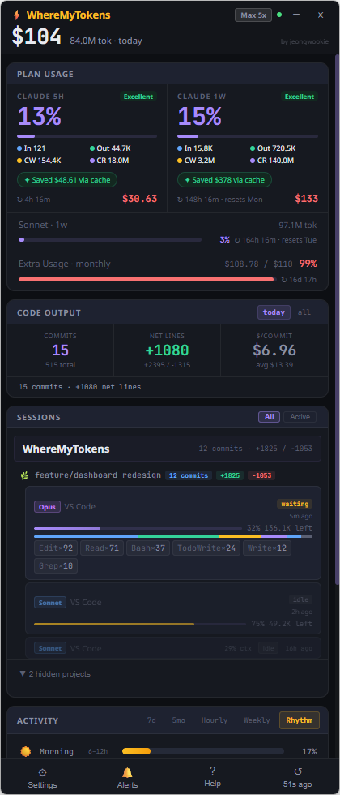
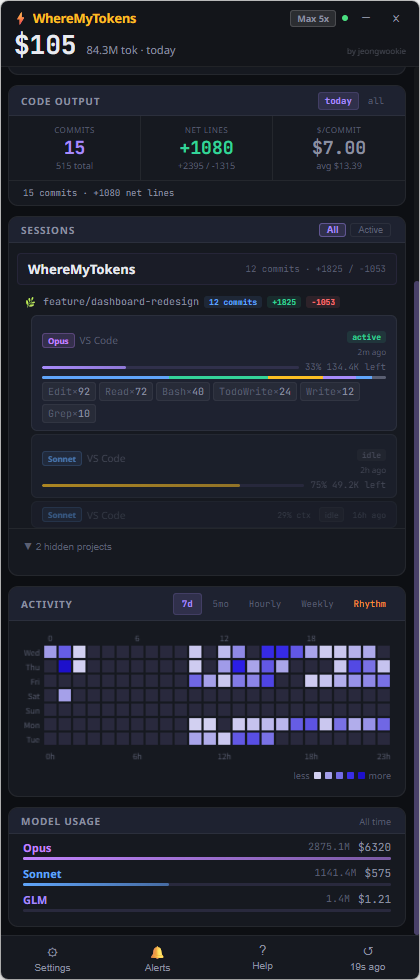

# WhereMyTokens

**Claude Code 토큰 사용량을 실시간으로 모니터링하는 Windows 시스템 트레이 앱.**

작업표시줄에 조용히 상주하며 Claude Code 사용량 — 토큰, 비용, 세션 활동, 속도 제한 — 을 한눈에 보여줍니다.


[English](README.md) · [日本語](README.ja.md)

---

## 주요 기능

- **실시간 세션 추적** — 실행 중인 Claude Code 세션(터미널, VS Code, Cursor, Windsurf 등)을 감지하고 실시간 상태를 표시: `active` / `waiting` / `idle` / `compacting`
- **2단계 세션 그루핑** — git 프로젝트 → 브랜치별로 그루핑, 프로젝트별 커밋·라인 통계 표시; idle 세션은 단계적 축소 (상위 3개 툴 → 컨텍스트 바만 → 한 줄 요약)
- **속도 제한 바** — Anthropic API에서 가져온 5시간·주간 사용량을 프로그레스 바, 리셋 카운터, 캐시 효율 등급(Excellent/Good/Fair/Poor)으로 표시
- **Claude Code 브리지** — WhereMyTokens를 Claude Code `statusLine` 플러그인으로 등록해 API 폴링 없이 실시간 속도 제한 데이터 수신
- **Code Output** — git 기반 생산성 지표: 커밋 수, 순 라인 변경, $/커밋 (today/all time 토글)
- **컨텍스트 창 경고** — 세션별 컨텍스트 바; 50%에서 황색, 80%에서 주황, 95%+에서 적색, "⚠ near limit" / "⚠ at limit" 표시
- **툴 사용 바** — 세션별 비례 색상 바 + 툴 칩(Bash, Edit, Read 등)
- **활동 탭** — 7일 히트맵, 5개월 캘린더(GitHub 스타일), 시간대별 분포, 4주 비교, **Rhythm** (시간대별 코딩 패턴, 그라데이션 바)
- **모델별 분석** — 전체 기간의 모델별 토큰·비용 합계, 그라데이션 바
- **비용 표시** — USD 또는 KRW, 구독 환산 가치
- **알림** — 설정 가능한 사용량 임계값(50% / 80% / 90%)에서 Windows 토스트 알림
- **프로젝트 관리** — UI에서 프로젝트 숨기기, 또는 추적에서 완전히 제외
- **Extra Usage 예산** — 월간 추가 사용량 카드로 크레딧 사용량·한도·비율 표시 (계정에서 활성화된 경우)
- **항상 위 위젯** — 다른 창 위에 고정 표시; 헤더의 `−` 버튼 또는 트레이 아이콘으로 최소화; 전역 단축키로 토글
- **트레이 라벨** — 작업표시줄에 사용량 %, 토큰 수, 또는 비용 직접 표시
- **기본 다크 테마** — 모던 다크 UI, 숫자 표시에 JetBrains Mono 폰트 사용

---

## 데모

<p align="center">
  <video src="https://github.com/user-attachments/assets/03ff7ed5-022d-4612-88f7-adc3666e1df5" width="380" autoplay loop muted>
    브라우저가 video 태그를 지원하지 않습니다.
  </video>
</p>

## 스크린샷

<table align="center">
  <tr>
    <td align="center" width="230">
      <br/>
      <sub><b>Plan Usage · Code Output · 세션</b></sub>
    </td>
    <td align="center" width="230">
      <br/>
      <sub><b>세션 · 7일 히트맵 · 모델별 분석</b></sub>
    </td>
    <td align="center" width="230">
      <br/>
      <sub><b>Activity · Rhythm 탭</b></sub>
    </td>
  </tr>
</table>

---

## Claude Code 연동 (브리지)

WhereMyTokens는 공식 `statusLine` 플러그인 메커니즘을 통해 Claude Code로부터 실시간 속도 제한 데이터를 받을 수 있습니다 — API 폴링 불필요.

**동작 방식:**
1. **Settings → Claude Code Integration → Setup** 실행
2. `~/.claude/settings.json`에 WhereMyTokens를 `statusLine` 명령으로 등록
3. Claude Code 실행 시마다 세션 데이터(속도 제한, 컨텍스트 %, 모델, 비용)를 stdin으로 전달
4. 앱이 즉시 업데이트 — 폴링 지연 없음

브리지는 컨텍스트 창 %, 모델, 비용 등 보조 데이터를 제공합니다. 속도 제한 퍼센트는 항상 Anthropic API를 권위 있는 소스로 사용하며, API를 사용할 수 없을 때만 브리지 값으로 폴백합니다.

---

## 요구 사항

- Windows 10 / 11
- [Node.js](https://nodejs.org) 18+ (개발 / 소스 빌드 시에만 필요)
- [Claude Code](https://claude.ai/code) 설치 및 로그인 상태

---

## 설치

### 방법 A — 사전 빌드된 실행 파일

1. [Releases](https://github.com/jeongwookie/WhereMyTokens/releases)에서 `WhereMyTokens-v1.4.0-win-x64.zip` 다운로드
2. ZIP 압축 해제
3. `WhereMyTokens.exe` 실행

첫 실행 시 자동으로 창이 열리고 시스템 트레이로 최소화됩니다.

### 방법 B — 소스에서 빌드

```bash
git clone https://github.com/jeongwookie/WhereMyTokens.git
cd WhereMyTokens
npm install
npm run build
npm start
```

### 설치 파일 빌드

```bash
npm run dist
# -> release/WhereMyTokens Setup x.x.x.exe  (NSIS 설치 파일)
# -> release/WhereMyTokens x.x.x.exe         (포터블)
```

> **참고:** Windows에서 NSIS 설치 파일 빌드 시 개발자 모드 활성화가 필요합니다  
> (설정 → 개발자용 → 개발자 모드).  
> `release/win-unpacked/`의 포터블 `.exe`는 개발자 모드 없이도 동작합니다.

---

## 사용법

1. 트레이 아이콘 클릭으로 대시보드 열기
2. **Settings**에서 설정:
   - **Claude Code Integration** — 실시간 속도 제한 데이터 연동
   - 통화 (USD / KRW)
   - 전역 단축키
   - 알림 임계값
   - 로그인 시 시작
   - 트레이 라벨 스타일

### 세션 목록

각 행에 표시되는 정보:
- 프로젝트 이름, 모델 태그, 워크트리 브랜치 (해당 시)
- 세션 상태 배지와 마지막 활동 시간
- **컨텍스트 바** — 세션별 항상 표시; 50%에서 황색, 80%에서 주황, 95%+에서 적색
- **툴 바** — 비례 색상 바 + 상위 3개 툴 이름과 호출 횟수

**All / Active**로 세션 필터링. 프로젝트 헤더에 마우스를 올리면:
- `x` — UI에서 숨기기 (추적은 계속)
- `⊘` — 추적에서 완전히 제외 (JSONL 파싱 없음, 세션 미표시)

숨긴 프로젝트는 세션 목록 하단의 토글로 복원할 수 있습니다. 제외된 프로젝트도 같은 위치에서 다시 활성화 가능합니다.

---

## 속도 제한 동작 방식

두 가지 데이터 소스를 우선순위 순서로 사용:

| 우선순위 | 소스 | 설명 |
|---------|------|------|
| 1순위 | **Anthropic API** | `/api/oauth/usage` — 웹 대시보드와 동일한 권위 있는 % 및 리셋 시간. 3분마다 가져오며 429 시 지수 백오프. |
| 2순위 | **브리지 (stdin)** | `statusLine`을 통해 Claude Code에서 전달되는 실시간 데이터. API 데이터를 사용할 수 없을 때 폴백으로 사용. |
| 폴백 | **마지막 알려진 값** | API 실패 시 마지막 성공 값 유지. 앱 시작 시 캐시 유효성 자동 검사 — 리셋 시각이 지난 stale 데이터는 자동 초기화. |

헤더의 점은 API 연결 상태를 표시합니다 (초록 = 연결됨, 빨강 = 연결 불가). 점에 마우스를 올리면 마지막 오류 메시지를 볼 수 있습니다. API가 일시적으로 불가하지만 이전 값이 있는 경우 속도 제한 바에 `(cached)` 라벨이 표시됩니다. API가 아직 성공적인 값을 반환하지 않은 경우(예: 첫 실행 또는 429 이후) 속도 제한 바는 `—`로 표시됩니다.

---

## 수치 계산 기준

모든 토큰 수(`tok`)는 **input + output + 캐시 생성 + 캐시 읽기**를 포함합니다 — Anthropic이 과금하는 모든 토큰 유형. 비용(`$`)은 항상 동일한 토큰 조합에 대한 API 환산 추정값입니다.

| 표시 위치 | 범위 | tok | $ |
|---------|------|-----|---|
| 헤더 | 오늘 자정 이후 | 모든 토큰 유형 | API 환산 |
| Plan Usage (5h / 1w) | 현재 빌링 창 | 모든 토큰 유형 | API 환산 |
| Model Usage | **전체 기간**, 모델별 | 모든 토큰 유형 | API 환산 |

> **참고:** `$` 값은 추정값으로 실제 청구액이 아닙니다. Claude Max/Pro 구독은 월정액입니다.

---

## 활동 탭

| 탭 | 설명 |
|----|------|
| 7d | 7일 히트맵 (요일 × 시간 그리드), 시간축 + 색상 범례 |
| 5mo | 5개월 캘린더 그리드 (GitHub 스타일, 날짜+토큰 호버) |
| Hourly | 최근 30일의 시간대별 토큰 분포 |
| Weekly | 최근 4주 가로 바 차트 |
| Rhythm | 시간대별 코딩 패턴 — Morning ☀️ / Afternoon 🔥 / Evening 🌆 / Night 🌙, 그라데이션 바 (7일, 로컬 타임존) |

---

## 데이터 & 개인정보

WhereMyTokens는 로컬 파일만 읽습니다:

| 파일 | 용도 |
|------|------|
| `~/.claude/sessions/*.json` | 세션 메타데이터 (pid, cwd, 모델) |
| `~/.claude/projects/**/*.jsonl` | 대화 로그 (토큰 수, 비용) |
| `~/.claude/.credentials.json` | OAuth 토큰 — Anthropic에서 본인 사용량 가져오는 데만 사용 |
| `%APPDATA%\WhereMyTokens\live-session.json` | `statusLine` 플러그인이 기록하는 브리지 데이터 |

데이터는 본인 사용량 통계를 가져오는 Anthropic API 호출 외에 어디에도 전송되지 않습니다.

---

## 개발

```bash
npm run build      # 아이콘 생성 + 컴파일 (main + renderer)
npm start          # 빌드 후 실행
npm run dev        # 워치 모드
npm run dist       # 빌드 + 패키지 설치 파일 생성
```

### 프로젝트 구조

```
assets/
  source-icon.png       소스 아이콘 (교체하면 앱 아이콘 변경)
  icon.ico              자동 생성되는 멀티사이즈 ICO (gitignore, 빌드 시 자동 생성)
scripts/
  make-icons.mjs        아이콘 파이프라인: 흰 배경 제거 + ICO 생성
  build-renderer.mjs    esbuild 렌더러 번들링
src/
  main/
    index.ts              Electron 메인, 트레이, 팝업 창
    stateManager.ts       폴링, 상태 조합, 브리지 연동
    sessionDiscovery.ts   ~/.claude/sessions/*.json 읽기
    jsonlParser.ts        대화 JSONL 파일 파싱
    usageWindows.ts       5h/1w 윈도우 집계 + 히트맵
    rateLimitFetcher.ts   Anthropic API 사용량 가져오기 (백오프 포함)
    bridgeWatcher.ts      statusLine 브리지의 live-session.json 감시
    ipc.ts                IPC 핸들러, 연동 설정
    preload.ts            contextBridge (window.wmt)
    usageAlertManager.ts  임계값 알림
  bridge/
    bridge.ts             statusLine 플러그인: stdin → live-session.json
  renderer/
    views/
      MainView.tsx         메인 대시보드
      SettingsView.tsx     설정
      NotificationsView.tsx
      HelpView.tsx
    components/
      SessionRow.tsx       세션 행 (컨텍스트 바 + 툴 바)
      TokenStatsCard.tsx   사용량 통계 + 속도 제한 바
      ActivityChart.tsx    히트맵 + 차트
      ModelBreakdown.tsx   모델별 합계
      ExtraUsageCard.tsx   Extra Usage 월간 예산 카드
```

---

## 면책 조항

표시되는 비용은 **API 환산 추정값**이며 실제 청구 금액이 아닙니다. Claude Max/Pro 구독은 월정액입니다. 비용 표시는 구독에서 얼마나 많은 사용 가치를 얻고 있는지를 보여주는 것이지, Anthropic이 청구하는 금액이 아닙니다.

---

## 감사의 말

macOS 버전인 [duckbar](https://github.com/rofeels/duckbar)에서 영감을 받았습니다.

---

## 라이선스

MIT
