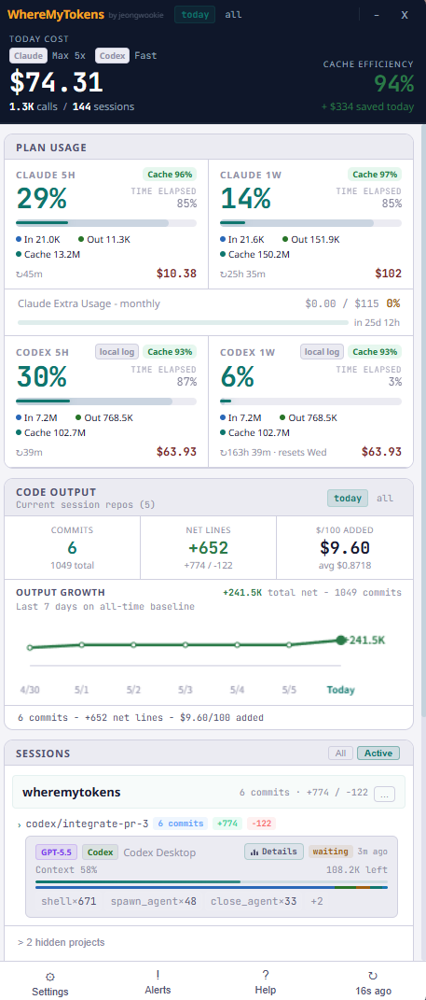

<p align="center">
  
</p>

<h1 align="center">WhereMyTokens</h1>

<p align="center">
  <strong>이제 Codex도 함께 추적합니다.</strong>
</p>

<p align="center">
  
  
  
</p>

<p align="center">
  
  
  
</p>

<p align="center">
  <a href="README.md">English</a> · <a href="README.ja.md">日本語</a> · <a href="README.zh-CN.md">中文</a> · <a href="README.es.md">Español</a>
</p>

<p align="center">
  <a href="https://github.com/jeongwookie/WhereMyTokens/releases/download/v1.10.1/WhereMyTokens-Setup.exe"><strong>v1.10.1 다운로드</strong></a>
  ·
  <a href="#주요-기능">주요 기능</a>
  ·
  <a href="#screenshots">스크린샷</a>
</p>

<p align="center">
  Claude Code와 Codex의 토큰, 비용, 세션, 캐시, 모델별 사용량, 속도 제한을 한눈에 보여주는 로컬 우선 Windows 트레이 앱입니다.
</p>

<a id="screenshots"></a>

<table>
  <tr>
    <th width="50%">라이트 모드</th>
    <th width="50%">다크 모드</th>
  </tr>
  <tr>
    <td></td>
    <td></td>
  </tr>
</table>

<table>
  <tr>
    <th width="33%">Rhythm & 피크 통계</th>
    <th width="33%">7일 히트맵</th>
    <th width="33%">설정</th>
  </tr>
  <tr>
    <td></td>
    <td></td>
    <td></td>
  </tr>
</table>

> Claude Code를 매일 사용하는 한국인 개발자가 직접 만들고 쓰고 있는 앱입니다.

## 최신 업데이트

| 버전 | 날짜 | 주요 변경 |
|------|------|---------|
| **[v1.10.1](https://github.com/jeongwookie/WhereMyTokens/releases/tag/v1.10.1)** | 4/22 | Fix Codex repo discovery for Code Output and harden session metadata caching |
| **[v1.10.0](https://github.com/jeongwookie/WhereMyTokens/releases/tag/v1.10.0)** | 4/22 | Claude + Codex 동시 추적, Codex 사용량 계산, 범위 기반 통계, 세션 UX/성능 개선 |
| **[v1.9.2](https://github.com/jeongwookie/WhereMyTokens/releases/tag/v1.9.2)** | 4/20 | NSIS 인스톨러, 세션 추적 정확도 및 안정성 개선 |
| **[v1.9.1](https://github.com/jeongwookie/WhereMyTokens/releases/tag/v1.9.1)** | 4/17 | 7d 히트맵 호버 툴팁 수정; zh-CN · es README 추가 |
| **[v1.9.0](https://github.com/jeongwookie/WhereMyTokens/releases/tag/v1.9.0)** | 4/17 | 틸 테마, 시스템 다크모드, 증분 JSONL 캐싱, idle 6h+ 자동 숨김 |

[→ 전체 변경 이력](https://github.com/jeongwookie/WhereMyTokens/releases)

---

## 다운로드

**[⬇ 인스톨러 다운로드 (.exe)](https://github.com/jeongwookie/WhereMyTokens/releases/download/v1.10.1/WhereMyTokens-Setup.exe)** — 받아서 실행하면 끝

**[⬇ 전체 릴리즈 파일](https://github.com/jeongwookie/WhereMyTokens/releases/latest)**

다운로드 또는 설치 시 [최종 사용자 라이선스 계약 (EULA)](EULA.ko.txt)에 동의하는 것으로 간주됩니다.

**옵션 A — 인스톨러** _(권장)_
1. 위 링크에서 `WhereMyTokens-Setup.exe` 다운로드
2. 인스톨러 실행 후 안내에 따라 설치
3. 앱이 자동으로 열리고 시스템 트레이에 상주합니다

**옵션 B — 포터블 ZIP** _(설치 불필요)_
1. 릴리즈 페이지에서 `WhereMyTokens-v1.10.1-win-x64.zip` 다운로드
2. 원하는 위치에 압축 해제
3. `WhereMyTokens.exe` 실행

---

## 주요 기능

### 세션 추적
- **Claude + Codex provider 모드** — Claude만, Codex만, 또는 둘 다 하나의 대시보드에서 추적
- **실시간 세션 감지** — Terminal, VS Code, Cursor, Windsurf 등, 실시간 상태: `active` / `waiting` / `idle` / `compacting`
- **Compact 그루핑** — git 프로젝트 → 브랜치별 그루핑, 반복 Claude/Codex 세션은 provider/source/model/state 기준으로 stack 처리
- **브랜치 row 제한** — 각 브랜치는 기본 3개 행만 표시하고 나머지는 "Show N more"로 펼침
- **컨텍스트 창 경고** — 세션별 바; 70% 황색, 85% 주황, 95%+ 적색
- **툴 사용 바** — 비례 색상 바 + 툴 칩 (Bash, Edit, Read 등)

### 속도 제한 & 알림
- **속도 제한 바** — Claude 5h/1w는 Anthropic API/statusLine 기준, Codex 5h/1w는 로컬 Codex rate-limit 로그 이벤트 기준
- **Claude Code 브리지** — `statusLine` 플러그인으로 API 폴링 없이 실시간 데이터 수신
- **Windows 토스트 알림** — 사용량 임계값(50% / 80% / 90%)에서 알림
- **Claude Extra Usage 예산** — Claude 월간 크레딧 사용량 / 한도 / 이용률 표시

### 분석 & 활동
- **헤더 통계** — today/all-time 토글: 비용, API 호출, 세션, 캐시 적중률, 절약 비용, 토큰 분석(In/Out/Cache)
- **활동 탭** — 7일 히트맵, 5개월 캘린더(GitHub 스타일), 시간대별 분포, 4주 비교
- **Rhythm 탭** — 시간대별 비용 분포 (Morning/Afternoon/Evening/Night), 그라데이션 바, 피크 상세 통계, 로컬 타임존
- **모델별 분석** — 상위 모델별 토큰·비용 합계, 그라데이션 바
- **Activity Breakdown** — Claude는 output 토큰 기준, Codex는 tool event 기준으로 10개 카테고리 분석 (Thinking, Edit/Write, Read, Search, Git 등)

### Code Output & 생산성
- **Git 기반 지표** — 커밋 수, 순 라인 변경, **$/100 Added** (100 추가 라인당 비용)
- **Today vs All-time** — 오늘의 추가 라인당 실제 비용과 전체 평균 비교
- **브랜치 반영 전체 기간** — Code Output의 전체 기간은 로컬 브랜치 전체의 커밋과 라인 변경을 로컬 git 작성자 이메일 기준으로 집계
- **자동 발견** — Claude 프로젝트는 `~/.claude/projects/`, Codex 세션은 `~/.codex/sessions/`에서 자동 포함
- **본인 커밋만** — `git config user.email` 기준 필터링

### 커스터마이징
- **Auto/Light/Dark 테마** — 기본값은 시스템 설정 따름
- **비용 표시** — USD 또는 KRW, 환율 설정 가능
- **항상 위 위젯** — 다른 창 위에 고정; 헤더 버튼, 트레이 아이콘, 전역 단축키로 최소화
- **트레이 라벨** — 사용량 %, 토큰 수, 비용 직접 표시
- **프로젝트 관리** — 숨기기 또는 추적에서 완전 제외
- **Windows 시작 시 자동 실행** — 선택적 자동 실행

---

## 빠른 시작

### 1. 대시보드 열기
트레이 아이콘 클릭 (또는 전역 단축키 `Ctrl+Shift+D`).

### 2. Claude Code 브리지 연결 (선택)
**Settings → Claude Code Integration → Setup** — API 폴링 없이 실시간 속도 제한 데이터 수신.

### 3. 설정
- **Tracking Provider** — Claude / Codex / Both
- **통화** — USD 또는 KRW
- **알림** — 사용량 임계값 설정 (50% / 80% / 90%)
- **테마** — Auto (시스템 설정 따름) / Light / Dark
- **트레이 라벨** — 작업표시줄에 표시할 정보 선택

---

## Claude Code 연동 (브리지)

WhereMyTokens는 공식 `statusLine` 플러그인 메커니즘을 통해 Claude Code로부터 실시간 속도 제한 데이터를 받을 수 있습니다 — API 폴링 불필요.

**동작 방식:**
1. **Settings → Claude Code Integration → Setup** 실행
2. `~/.claude/settings.json`에 WhereMyTokens를 `statusLine` 명령으로 등록
3. Claude Code 실행 시마다 세션 데이터(속도 제한, 컨텍스트 %, 모델, 비용)를 stdin으로 전달
4. 앱이 즉시 업데이트 — 폴링 지연 없음

브리지는 컨텍스트 창 %, 모델, 비용 등 보조 데이터를 제공합니다. 속도 제한 퍼센트는 항상 Anthropic API를 권위 있는 소스로 사용하며, API를 사용할 수 없을 때만 브리지 값으로 폴백합니다.

---

## Codex 추적

WhereMyTokens는 Codex의 로컬 JSONL 로그(`~/.codex/sessions/**/*.jsonl`)도 읽을 수 있습니다. Settings에서 **Claude**, **Codex**, **Both** 중 하나를 선택합니다.

**Codex 추적에 포함되는 내용:**
- 세션 상태, 프로젝트/브랜치 그루핑, VS Code 또는 Codex Exec 같은 source 표시
- GPT/Codex 모델별 사용량과 API 환산 비용 추정
- input, cached input, output 토큰, 캐시 절약액, 전체 기간 모델별 합계
- 로컬 로그에 `rate_limits` 이벤트가 있을 때 Codex 5h/1w 사용률과 reset 시간
- Codex 로그는 tool별 output token이 아니라 tool call을 제공하므로, Activity Breakdown은 tool event count 기준으로 표시

**Codex 캐시 계산식:** Codex 로그는 `input_tokens`와 `cached_input_tokens`를 제공합니다. WhereMyTokens는 uncached input을 `input_tokens - cached_input_tokens`로, cached input을 cache-read token으로 저장하고, 캐시 효율은 다음처럼 표시합니다.

```text
cached_input_tokens / input_tokens
```

Claude의 캐시 효율은 다음 식을 사용합니다.

```text
cache_read_input_tokens / (cache_read_input_tokens + cache_creation_input_tokens)
```

---

## 속도 제한 동작 방식

Claude와 Codex는 서로 다른 한도 소스와 5h/1w reset window를 사용합니다.

| 우선순위 | 소스 | 설명 |
|---------|------|------|
| Claude 1순위 | **Anthropic API** | `/api/oauth/usage` — 웹 대시보드와 동일한 권위 있는 데이터. 3분마다 조회, 429 시 지수 백오프. |
| Claude 2순위 | **브리지 (stdin)** | `statusLine`을 통해 Claude Code에서 전달되는 실시간 데이터. API 불가 시 폴백. |
| Codex | **로컬 Codex 로그** | `~/.codex/sessions/**/*.jsonl` 내부 `rate_limits` 이벤트 중 가장 최신 값을 사용. |
| 폴백 | **마지막 알려진 값** | 데이터 실패 시 마지막 성공 값 유지. 리셋 시각이 지난 stale 데이터는 자동 초기화. |

헤더의 점은 API 연결 상태를 표시합니다 (초록 = 연결됨, 빨강 = 연결 불가). 점에 마우스를 올리면 오류 메시지를 볼 수 있습니다.

---

## 수치 계산 기준

모든 토큰 수는 가능한 경우 **input + output + 캐시 생성 + 캐시 읽기**를 포함합니다. 비용은 앱 내부 가격표를 사용한 API 환산 추정값입니다.

Claude는 input, output, cache creation, cache read를 제공합니다. Codex는 raw input, cached input, output을 제공하므로, WhereMyTokens는 raw input을 uncached input과 cached input으로 나눠 캐시 절약액과 모델별 합계가 중복 계산되지 않게 합니다.

| 표시 위치 | 범위 | 포함 내용 |
|---------|------|----------|
| 헤더 (today) | 오늘 자정 이후 | In/Out/Cache + 호출 수, 세션 수, 캐시 절약 |
| 헤더 (all) | 전체 기간 | In/Out/Cache + 호출 수, 세션 수, 캐시 절약 |
| Plan Usage (Claude 5h / 1w) | Claude reset window | Claude 토큰 유형 + API/statusLine 한도 |
| Plan Usage (Codex 5h / 1w) | Codex reset window | Codex 토큰 유형 + 로컬 rate-limit 이벤트 |
| Model Usage | 전체 기간, provider별 상위 4개 모델 | 모든 토큰 유형 |

> **참고:** `$` 값은 추정값으로 실제 청구액이 아닙니다. Claude Max/Pro 구독은 월정액이며, 비용 표시는 구독에서 얻는 사용 가치를 보여줍니다.

---

## 활동 탭

| 탭 | 설명 |
|----|------|
| 7d | 7일 히트맵 (요일 × 시간 그리드), 시간축 + 색상 범례 |
| 5mo | 5개월 캘린더 그리드 (GitHub 스타일, 날짜+토큰 호버) |
| Hourly | 최근 30일의 시간대별 토큰 분포 |
| Weekly | 최근 4주 가로 바 차트 |
| Rhythm | 시간대별 비용 분포 — Morning ☀️ / Afternoon 🔥 / Evening 🌆 / Night 🌙, 그라데이션 바, 피크 상세 통계, 로컬 타임존 (30일) |

---

## Activity Breakdown

세션 행의 **Details** 버튼을 클릭하면 카테고리별 활동 분석 패널이 펼쳐집니다. Claude 세션은 output token 배분을 표시하고, Codex 세션은 tool별 output token 대신 function/tool call 로그가 있으므로 tool event count를 표시합니다. 한 번에 하나만 열림.

| 카테고리 | 색상 | 소스 |
|---------|------|------|
| 💭 Thinking | 틸 | 확장 사고 블록 |
| 💬 Response | 슬레이트 | 텍스트 블록 — 최종 응답 |
| 📄 Read | 블루 | `Read` 툴 |
| ✏️ Edit / Write | 바이올렛 | `Edit`, `Write`, `MultiEdit`, `NotebookEdit` |
| 🔍 Search | 스카이 | `Grep`, `Glob`, `LS`, `TodoRead`, `TodoWrite` |
| 🌿 Git | 그린 | `Bash` — `git` 명령 |
| ⚙️ Build / Test | 오렌지 | `Bash` — `npm`, `tsc`, `jest`, `cargo`, `python` 등 |
| 💻 Terminal | 앰버 | 기타 `Bash` 명령; `mcp__*` 툴 |
| 🤖 Subagents | 핑크 | `Agent` 툴 |
| 🌐 Web | 퍼플 | `WebFetch`, `WebSearch` |

> **토큰 배분:** 각 턴의 output 토큰을 컨텐츠 블록 문자 수 비율로 분배 (`블록 문자 수 ÷ 전체 문자 수 × output 토큰`). 값이 0인 카테고리는 숨김.

---

## 데이터 & 개인정보

WhereMyTokens는 로컬 파일만 읽습니다 — 클라우드 동기화 없음, 텔레메트리 없음.

| 파일 | 용도 |
|------|------|
| `~/.claude/sessions/*.json` | 세션 메타데이터 (pid, cwd, 모델) |
| `~/.claude/projects/**/*.jsonl` | 대화 로그 (토큰 수, 비용) |
| `~/.claude/.credentials.json` | OAuth 토큰 — Anthropic에서 본인 사용량 조회용 |
| `~/.codex/sessions/**/*.jsonl` | Codex 세션 로그 (토큰 수, cached input, 모델, rate-limit 이벤트, tool call) |
| `%APPDATA%\WhereMyTokens\live-session.json` | `statusLine` 플러그인 브리지 데이터 |

---

## 소스에서 설치

### 요구 사항

- Windows 10 / 11
- [Node.js](https://nodejs.org) 18+
- [Claude Code](https://claude.ai/code) 설치 및 로그인 상태

### 빌드 & 실행

```bash
git clone https://github.com/jeongwookie/WhereMyTokens.git
cd WhereMyTokens
npm install
npm run build
npm start
```

### 설치 파일 빌드

```bash
npm run dist
# -> release/WhereMyTokens Setup x.x.x.exe  (NSIS 설치 파일)
# -> release/WhereMyTokens x.x.x.exe         (포터블)
```

> **참고:** Windows에서 NSIS 설치 파일 빌드 시 개발자 모드 활성화가 필요합니다 (설정 → 개발자용 → 개발자 모드). `release/win-unpacked/`의 포터블 `.exe`는 개발자 모드 없이도 동작합니다.

---

## 데모

<div align="center">

https://github.com/user-attachments/assets/98b6f8d7-6fc6-4c12-aef1-af6300db0728

</div>

---

## 면책 조항

표시되는 비용은 **API 환산 추정값**이며 실제 청구 금액이 아닙니다. Claude Max/Pro 구독은 월정액이며, 비용 표시는 구독에서 얼마나 많은 사용 가치를 얻고 있는지를 보여줍니다.

---

## 기여하기

이슈와 풀 리퀘스트를 환영합니다. 변경하고 싶은 사항이 있으면 먼저 이슈를 열어주세요.

---

## 감사의 말

macOS 버전인 [duckbar](https://github.com/rofeels/duckbar)에서 영감을 받았습니다.

---

## 라이선스

MIT
