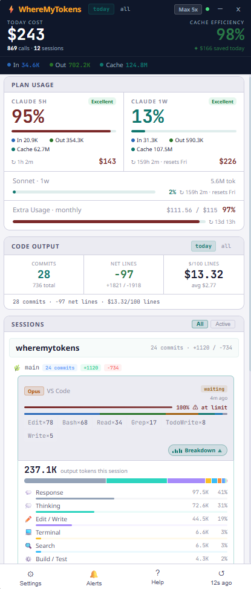
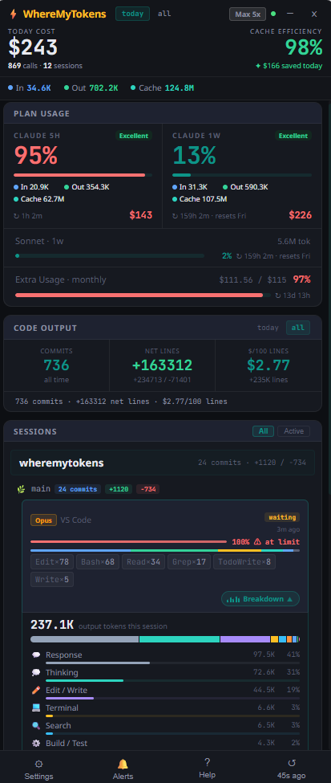
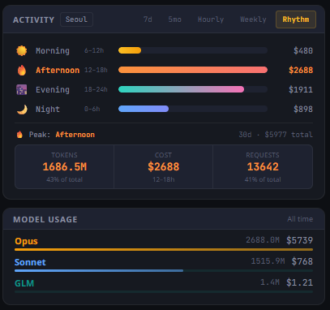
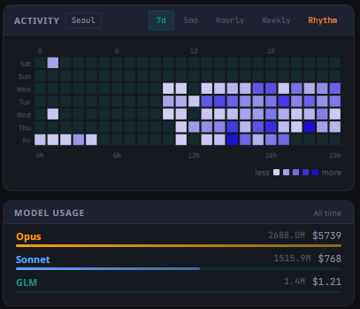
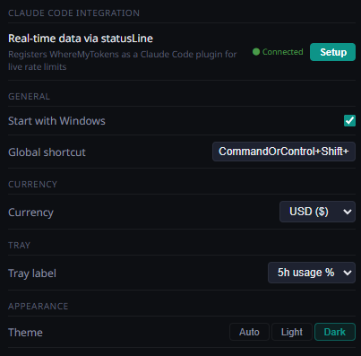

# WhereMyTokens

**Windows system tray app for monitoring Claude Code token usage in real time.**

Built by a Korean developer who uses Claude Code daily — scratching my own itch.

Sits quietly in your taskbar and shows Claude Code usage — tokens, costs, session activity, and rate limits — at a glance.


> [한국어](README.ko.md) | [日本語](README.ja.md)

> 💾 **No cloud sync** — reads only local Claude files. Your data never leaves your machine.

<div align="center">

https://github.com/user-attachments/assets/98b6f8d7-6fc6-4c12-aef1-af6300db0728

</div>

<table>
  <tr>
    <th width="50%">Dashboard — Today</th>
    <th width="50%">Dashboard — All Time</th>
  </tr>
  <tr>
    <td></td>
    <td></td>
  </tr>
</table>

<table>
  <tr>
    <th width="33%">Rhythm & Peak Stats</th>
    <th width="33%">7-Day Heatmap</th>
    <th width="33%">Settings</th>
  </tr>
  <tr>
    <td></td>
    <td></td>
    <td></td>
  </tr>
</table>

## Download

**[⬇ Download Latest Release](https://github.com/jeongwookie/WhereMyTokens/releases/latest)**

1. Download `WhereMyTokens-v1.9.0-win-x64.zip`
2. Extract the zip anywhere
3. Run `WhereMyTokens.exe`

That's it — no installer needed. The app opens automatically and sits in your system tray.

---

## Features

### Session Tracking
- **Live session detection** — Terminal, VS Code, Cursor, Windsurf, and more with real-time status: `active` / `waiting` / `idle` / `compacting`
- **2-level grouping** — sessions grouped by git project → branch, with per-project commit stats and line counts
- **Idle auto-hide** — idle sessions progressively collapse; 6h+ sessions are auto-hidden with an expandable toggle
- **Context window warnings** — per-session bar; amber at 50%, orange at 80%, red at 95%+
- **Tool usage bars** — proportional color bar + tool chips (Bash, Edit, Read, …)

### Rate Limits & Alerts
- **Rate limit bars** — 5h and 1w usage from Anthropic's API, with progress bars, time-to-reset counters, and cache efficiency grades
- **Claude Code bridge** — register as a `statusLine` plugin for live rate limit data without API polling
- **Windows toast notifications** — at configurable usage thresholds (50% / 80% / 90%)
- **Extra Usage budget** — monthly credits used / limit / utilization %

### Analytics & Activity
- **Header stats** — today/all-time toggle: cost, API calls, sessions, cache efficiency, savings, token breakdown (In/Out/Cache)
- **Activity tabs** — 7-day heatmap, 5-month calendar (GitHub-style), hourly distribution, 4-week comparison
- **Rhythm tab** — time-of-day cost distribution (Morning/Afternoon/Evening/Night) with gradient bars, peak detail stats, local timezone
- **Model breakdown** — per-model token and cost totals with gradient bars
- **Activity Breakdown** — per-session output token analysis across 10 categories (Thinking, Edit/Write, Read, Search, Git, etc.)

### Code Output & Productivity
- **Git-based metrics** — commits, net lines changed, **$/100 Lines** (cost per 100 lines added)
- **Today vs all-time** — today shows actual cost-per-line with average for comparison
- **Auto-discovery** — every project you've used Claude on via `~/.claude/projects/` — no active session required
- **Your commits only** — filtered by `git config user.email`

### Customization
- **Auto/Light/Dark theme** — follows system preference by default
- **Cost display** — USD or KRW with configurable exchange rate
- **Always-on-top widget** — stays visible; minimize via header button, tray icon, or global hotkey
- **Tray label** — show usage %, token count, or cost directly in the taskbar
- **Project management** — hide or fully exclude projects from tracking
- **Start with Windows** — optional auto-launch at login

---

## Quick Start

### 1. Open the dashboard
Click the tray icon (or press the global shortcut `Ctrl+Shift+D`).

### 2. Connect Claude Code bridge (optional)
**Settings → Claude Code Integration → Setup** — enables live rate limit data without API polling.

### 3. Configure
- **Currency** — USD or KRW
- **Alerts** — set usage thresholds (50% / 80% / 90%)
- **Theme** — Auto (follows system) / Light / Dark
- **Tray label** — choose what to display in the taskbar

---

## Claude Code Integration (Bridge)

WhereMyTokens can receive live rate limit data from Claude Code via the official `statusLine` plugin mechanism — no API polling required.

**How it works:**
1. Open **Settings → Claude Code Integration → Setup**
2. This registers WhereMyTokens as a `statusLine` command in `~/.claude/settings.json`
3. Each time Claude Code runs, it pipes session data (rate limits, context %, model, cost) to WhereMyTokens via stdin
4. The app updates immediately — no polling delay

The bridge provides supplementary context data (context window %, model, cost). Rate limit percentages always use the Anthropic API as the authoritative source; bridge values serve as a fallback when the API is unavailable.

---

## How rate limits work

Two data sources, used in priority order:

| Priority | Source | Description |
|----------|--------|-------------|
| 1st | **Anthropic API** | `/api/oauth/usage` — authoritative % and reset times. Fetched every 3 min; exponential backoff on 429. |
| 2nd | **Bridge (stdin)** | Live data from Claude Code via `statusLine`. Used as fallback when API is unavailable. |
| Fallback | **Last known value** | On API failure, the last successful value is kept. Stale data past its reset window is auto-cleared. |

The dot in the header shows API connectivity (green = connected, red = unreachable). Hover to see the last error message.

---

## How numbers work

All token counts include **input + output + cache creation + cache reads** — every token type Anthropic charges for. Cost is always the API-equivalent estimate.

| Display | Scope | What's counted |
|---------|-------|----------------|
| Header (today) | Since midnight | In/Out/Cache + calls, sessions, cache savings |
| Header (all) | All time | In/Out/Cache + calls, sessions, cache savings |
| Plan Usage (5h / 1w) | Current billing window | All token types |
| Model Usage | All time, per model | All token types |

> **Note:** `$` values are estimates — not your actual bill. Claude Max/Pro subscriptions are flat monthly fees. The cost display shows how much usage value you are getting.

---

## Activity tabs

| Tab | Description |
|-----|-------------|
| 7d | 7-day heatmap (day-of-week × hour grid) with time axis and color legend |
| 5mo | 5-month calendar grid (GitHub-style, hover for date + tokens) |
| Hourly | Hourly token distribution across the last 30 days |
| Weekly | Last 4 weeks horizontal bar chart |
| Rhythm | Time-of-day cost distribution — Morning ☀️ / Afternoon 🔥 / Evening 🌆 / Night 🌙 with gradient bars, peak detail stats (tokens, cost, requests %), and local timezone (30-day) |

---

## Activity Breakdown

Click the **Breakdown** button on any session row to expand a per-category breakdown of output tokens. One panel open at a time.

| Category | Color | Source |
|----------|-------|--------|
| 💭 Thinking | Teal | Extended thinking blocks |
| 💬 Response | Slate | Text blocks — the final answer |
| 📄 Read | Blue | `Read` tool |
| ✏️ Edit / Write | Violet | `Edit`, `Write`, `MultiEdit`, `NotebookEdit` |
| 🔍 Search | Sky | `Grep`, `Glob`, `LS`, `TodoRead`, `TodoWrite` |
| 🌿 Git | Green | `Bash` — `git` commands |
| ⚙️ Build / Test | Orange | `Bash` — `npm`, `tsc`, `jest`, `cargo`, `python`, etc. |
| 💻 Terminal | Amber | Other `Bash` commands; `mcp__*` tools |
| 🤖 Subagents | Pink | `Agent` tool |
| 🌐 Web | Purple | `WebFetch`, `WebSearch` |

> **Token attribution:** each turn's output tokens are split across content blocks by character proportion (`block_chars ÷ total_chars × output_tokens`). Zero-value categories are hidden.

---

## Data & Privacy

WhereMyTokens reads only local files — no cloud sync, no telemetry.

| File | Purpose |
|------|---------|
| `~/.claude/sessions/*.json` | Session metadata (pid, cwd, model) |
| `~/.claude/projects/**/*.jsonl` | Conversation logs (token counts, costs) |
| `~/.claude/.credentials.json` | OAuth token — used only to fetch your own usage from Anthropic |
| `%APPDATA%\WhereMyTokens\live-session.json` | Bridge data written by the `statusLine` plugin |

---

## Install from Source

### Requirements

- Windows 10 / 11
- [Node.js](https://nodejs.org) 18+
- [Claude Code](https://claude.ai/code) installed and logged in

### Build & Run

```bash
git clone https://github.com/jeongwookie/WhereMyTokens.git
cd WhereMyTokens
npm install
npm run build
npm start
```

### Build installer

```bash
npm run dist
# -> release/WhereMyTokens Setup x.x.x.exe  (NSIS installer)
# -> release/WhereMyTokens x.x.x.exe         (portable)
```

> **Note:** Building the NSIS installer on Windows requires Developer Mode enabled (Settings → For Developers → Developer Mode). The portable `.exe` in `release/win-unpacked/` works without it.

---

## Project structure

```
src/
  main/
    index.ts              Electron main, tray, popup window
    stateManager.ts       Polling, state assembly, bridge integration
    jsonlParser.ts        Parses conversation JSONL files (with incremental cache)
    jsonlCache.ts         mtime-based JSONL parse cache
    sessionDiscovery.ts   Reads ~/.claude/sessions/*.json
    usageWindows.ts       5h/1w window aggregation + heatmaps
    rateLimitFetcher.ts   Anthropic API usage fetch (with backoff)
    bridgeWatcher.ts      Watches live-session.json from statusLine bridge
    gitStatsCollector.ts  Git branch, commit, and line stats
    ipc.ts                IPC handlers, settings, integration setup
    preload.ts            contextBridge (window.wmt)
  bridge/
    bridge.ts             statusLine plugin: stdin → live-session.json
  renderer/
    App.tsx               Root with theme provider + system dark mode detection
    theme.ts              Light/Dark palettes + CSS custom properties
    views/                MainView, SettingsView, NotificationsView, HelpView
    components/           SessionRow, TokenStatsCard, ActivityChart, CodeOutputCard, ...
```

---

## Disclaimer

Costs shown are **API-equivalent estimates**, not actual billing. Claude Max/Pro subscriptions are flat monthly fees. The cost display shows how much usage value you are getting out of your subscription.

---

## Acknowledgements

Inspired by [duckbar](https://github.com/rofeels/duckbar) — the macOS counterpart.

---

## License

MIT
