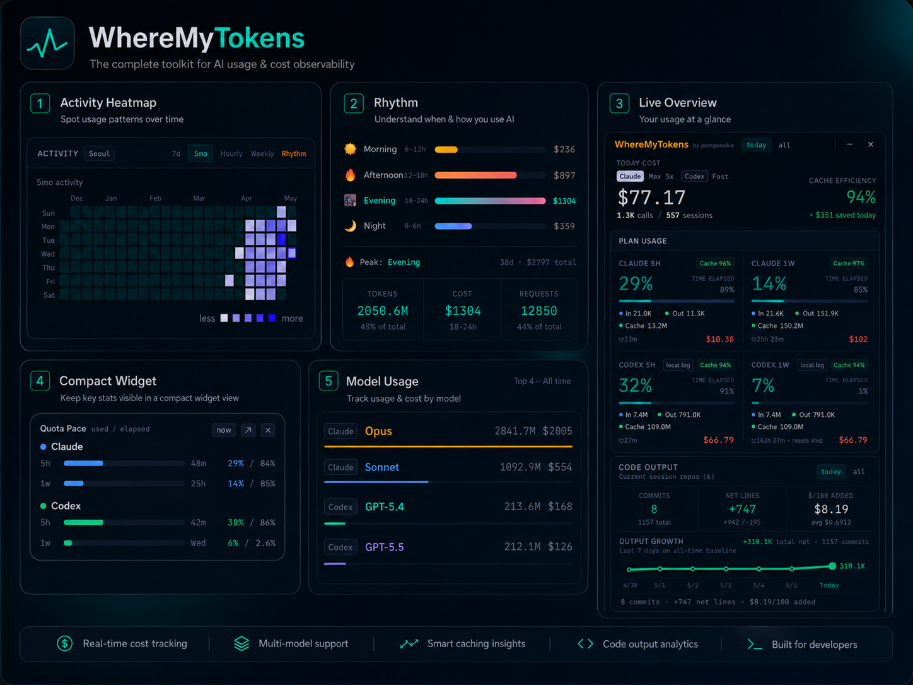

<p align="center">
  
</p>

<h1 align="center">WhereMyTokens</h1>

<p align="center">
  <strong>现已支持 Codex 追踪。</strong>
</p>

<p align="center">
  
  
  
</p>

<p align="center">
  
  
  
</p>

<p align="center">
  <a href="README.md">English</a> · <a href="README.ko.md">한국어</a> · <a href="README.ja.md">日本語</a> · <a href="README.es.md">Español</a>
</p>

<p align="center">
  <a href="https://github.com/jeongwookie/WhereMyTokens/releases/download/v1.11.6/WhereMyTokens-Setup.exe"><strong>下载 v1.11.6</strong></a>
  ·
  <a href="#功能特性">功能特性</a>
  ·
  <a href="#screenshots">截图</a>
</p>

<p align="center">
  一个本地优先的 Windows 托盘应用，可一目了然地查看 Claude Code 与 Codex 的令牌、费用、会话、缓存、模型使用量和速率限制。
</p>

<a id="screenshots"></a>

<table>
  <tr>
    <th width="50%">深色总览</th>
    <th width="50%">浅色总览</th>
  </tr>
  <tr>
    <td></td>
    <td></td>
  </tr>
</table>

> 由每天使用 Claude Code 的韩国开发者打造 — 为自己而做。

## 最新更新

| 版本 | 日期 | 主要变更 |
|------|------|--------|
| **[v1.11.6](https://github.com/jeongwookie/WhereMyTokens/releases/tag/v1.11.6)** | 4/27 | 新增安装程序启动时的 English/한국어/日本語/简体中文/Español 语言选择，同时保持 EULA 正文为英文 |
| **[v1.11.5](https://github.com/jeongwookie/WhereMyTokens/releases/tag/v1.11.5)** | 4/26 | 稳定长时间运行时的弹出会话保留范围，阻止 changed file 让 scoped refresh 再次扩张的路径，并新增带开关的 crash/memory 诊断计测 |
| **[v1.11.4](https://github.com/jeongwookie/WhereMyTokens/releases/tag/v1.11.4)** | 4/25 | 将弹出会话列表稳定在最近 + 活跃工作范围内，降低隐藏托盘时的刷新成本，并加强主进程诊断日志 |
| **[v1.11.3](https://github.com/jeongwookie/WhereMyTokens/releases/tag/v1.11.3)** | 4/24 | 降低空闲时后台刷新开销，整理头部元数据，并为 Code Output 标明当前会话 repo 范围 |
| **[v1.11.2](https://github.com/jeongwookie/WhereMyTokens/releases/tag/v1.11.2)** | 4/24 | 补充 Partial History 启动同步与头部状态说明，并更新应用内帮助 |

[→ 完整更新日志](https://github.com/jeongwookie/WhereMyTokens/releases)

---

## 下载

**[⬇ 下载安装程序 (.exe)](https://github.com/jeongwookie/WhereMyTokens/releases/download/v1.11.6/WhereMyTokens-Setup.exe)** — 下载后直接运行即可

**[⬇ 下载便携 ZIP](https://github.com/jeongwookie/WhereMyTokens/releases/download/v1.11.6/WhereMyTokens-v1.11.6-win-x64.zip)** — 无需安装

下载或安装即表示您同意[最终用户许可协议 (EULA)](EULA.txt)。

**方式 A — 安装程序** _(推荐)_
1. 点击上方链接下载 `WhereMyTokens-Setup.exe`
2. 运行安装程序并按向导完成安装
3. 应用自动打开并驻留在系统托盘中

**方式 B — 便携 ZIP** _(无需安装)_
1. 在发布页面下载 `WhereMyTokens-v1.11.6-win-x64.zip`
2. 解压到任意位置
3. 运行 `WhereMyTokens.exe`

---

## 功能特性

### 会话追踪
- **Claude + Codex provider 模式** — 可在同一仪表板中追踪 Claude、Codex 或两者
- **实时会话检测** — 终端、VS Code、Cursor、Windsurf 等，实时状态：`active` / `waiting` / `idle` / `compacting`
- **紧凑分组** — 按 git 项目 → 分支分组，重复的 Claude/Codex 会话会按 provider/source/model/state 堆叠
- **分支行数限制** — 每个分支默认显示前 3 行，其余通过 "Show N more" 展开
- **上下文窗口警告** — 每会话进度条；70% 琥珀色、85% 橙色、95%+ 红色
- **工具使用条** — 比例颜色条 + 工具标签（Bash、Edit、Read 等）

### 速率限制与提醒
- **速率限制条** — Claude 5h/1w 来自 Anthropic API/statusLine；Codex 5h/1w 来自本地 Codex rate-limit 日志事件
- **Quota Pace 视图** — 对比已用额度 % 与已过时间 %，黄色/红色表示消耗速度快于重置窗口
- **Claude Code 桥接** — 注册为 `statusLine` 插件，无需 API 轮询即可获取实时数据
- **Windows 通知** — 在可配置的使用阈值（50% / 80% / 90%）时弹出提醒
- **Claude Extra Usage 预算** — Claude 月度额度使用量 / 限额 / 利用率

### 分析与活动
- **标题栏统计** — today/all-time 切换：费用、API 调用、会话、缓存效率、节省金额、紧凑的 Claude/Codex 元数据，以及用于显示 Claude 回退/reset 状态的单一状态 pill
- **启动友好的历史同步** — 先显示当前会话和最近用量，较早的历史会带着 `Partial History` 提示在后台继续同步
- **活动标签页** — 7天热力图、5个月日历（GitHub 风格）、按小时分布、4周对比
- **Rhythm 标签页** — 按时段费用分布（Morning/Afternoon/Evening/Night），渐变条，峰值详细统计，本地时区
- **模型分析** — 按热门模型的令牌和费用总计，渐变条
- **Activity Breakdown** — Claude 按 output token 分析，Codex 按 tool event 分析 10 个类别（Thinking、Edit/Write、Read、Search、Git 等）

### 代码产出与生产力
- **Git 指标** — 提交数、净变更行数、**$/100 Added**（每100行新增的成本）
- **今日 vs 全部** — 今日显示每新增行实际成本与历史平均对比
- **Output 增长图** — 按最近 7 个本地日期显示全时段累计净行数增长
- **当前会话 repo 范围** — Code Output 会明确标注其 git 汇总是基于当前正在追踪的会话关联 repo
- **分支感知的全时段** — Code Output 的全时段会按本地 git 作者邮箱统计所有本地分支的提交和行变更
- **自动发现** — Claude 项目来自 `~/.claude/projects/`，Codex 会话来自 `~/.codex/sessions/`
- **仅统计您的提交** — 按 `git config user.email` 过滤

### 个性化
- **Auto/Light/Dark 主题** — 默认跟随系统偏好
- **费用显示** — USD 或 KRW，可配置汇率
- **Floating usage widget** — 始终置顶显示的小型 Quota Pace 悬浮窗口；可从托盘菜单、Settings 或小部件按钮显示/隐藏
- **托盘标签** — 在任务栏直接显示使用率 %、令牌数或费用
- **项目管理** — 隐藏或完全排除项目
- **随 Windows 启动** — 可选自动启动

---

## 快速开始

### 1. 打开仪表板
点击托盘图标（或按全局快捷键 `Ctrl+Shift+D`）。

### 2. 连接 Claude Code 桥接（可选）
**Settings → Claude Code Integration → Setup** — 无需 API 轮询即可获取实时速率限制数据。

### 3. 配置
- **Tracking Provider** — Claude / Codex / Both
- **货币** — USD 或 KRW
- **提醒** — 设置使用阈值（50% / 80% / 90%）
- **主题** — Auto（跟随系统）/ Light / Dark
- **托盘标签** — 选择任务栏显示内容
- **Floating usage widget** — 启用小型 Quota Pace 窗口；之后可右键托盘图标显示或隐藏

---

## 启动与头部状态

启动时，仪表板会先显示当前会话和最近用量。如果看到 `Partial History`，说明较早的历史仍在后台同步，这样托盘应用可以更快打开。

头部状态 pill 会集中显示最重要的 Claude/API 状态。常见标签包括 `Local estimate`（使用本地回退数据）、`Reset unavailable`（已有当前用量但缺少 reset 时间）、`Rate limited` 和 `API offline`。把鼠标移到 pill 上可以查看最新细节。

---

## Codex 追踪

WhereMyTokens 也可以读取 Codex 的本地 JSONL 日志：`~/.codex/sessions/**/*.jsonl`。在 Settings 中选择 **Claude**、**Codex** 或 **Both**。

**Codex 追踪包含：**
- 会话状态、项目/分支分组，以及 VS Code、Codex Exec 等 source 标签
- GPT/Codex 模型使用量与 API 等价费用估算
- input、cached input、output 令牌、缓存节省金额和全时段模型合计
- 当本地日志包含 `rate_limits` 事件时，显示 Codex 5h/1w 使用率与 reset 时间
- Codex 日志提供 tool call，而不是每个工具的 output token，因此 Activity Breakdown 显示 tool event count

**Codex 缓存计算：** Codex 日志提供 `input_tokens` 和 `cached_input_tokens`。WhereMyTokens 将 uncached input 保存为 `input_tokens - cached_input_tokens`，将 cached input 作为 cache-read token，并使用以下公式显示缓存效率：

```text
cached_input_tokens / input_tokens
```

Claude 的缓存效率使用：

```text
cache_read_input_tokens / (cache_read_input_tokens + cache_creation_input_tokens)
```

---

## 数字如何计算

令牌数会尽可能包含 **input + output + cache creation + cache reads**。费用始终是基于应用内价格表的 API 等价估算值。

Claude 提供 input、output、cache creation 与 cache read。Codex 提供 raw input、cached input 与 output，因此 WhereMyTokens 会把 raw input 拆成 uncached input 与 cached input，避免缓存节省金额和模型合计重复计算。

Claude 和 Codex 使用独立的 5h/1w reset window。Claude 限额优先使用 Anthropic API，其次使用 statusLine/cache；Codex 限额使用本地 Codex JSONL 中最新的 `rate_limits` 事件。

---

## 数据与隐私

WhereMyTokens 仅读取本地文件 — 无云同步，无遥测。

| 文件 | 用途 |
|------|------|
| `~/.claude/sessions/*.json` | 会话元数据（pid、cwd、模型） |
| `~/.claude/projects/**/*.jsonl` | 对话日志（令牌数、费用） |
| `~/.claude/.credentials.json` | OAuth 令牌 — 仅用于从 Anthropic 获取您的使用统计 |
| `~/.codex/sessions/**/*.jsonl` | Codex 会话日志（令牌、cached input、模型、rate-limit 事件、tool call） |
| `%APPDATA%\WhereMyTokens\live-session.json` | `statusLine` 插件写入的桥接数据 |

---

## 从源码安装

### 环境要求

- Windows 10 / 11
- [Node.js](https://nodejs.org) 18+
- [Claude Code](https://claude.ai/code) 已安装并登录

### 构建与运行

```bash
git clone https://github.com/jeongwookie/WhereMyTokens.git
cd WhereMyTokens
npm install
npm run build
npm start
```

---

## 演示

<div align="center">

https://github.com/user-attachments/assets/98b6f8d7-6fc6-4c12-aef1-af6300db0728

</div>

---

## 免责声明

显示的费用为 **API 等价估算值**，并非实际账单。Claude Max/Pro 订阅为月度固定费用。费用显示的是您从订阅中获得的使用价值。

---

## 贡献

欢迎提交 Issue 和 Pull Request。如需变更，请先开一个 Issue 进行讨论。

---

## 致谢

灵感来自 [duckbar](https://github.com/rofeels/duckbar) — macOS 版本。

---

## 许可证

MIT
